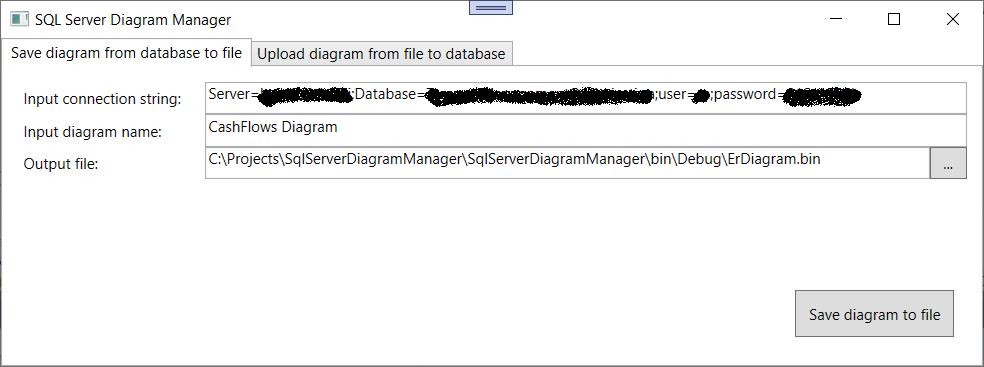
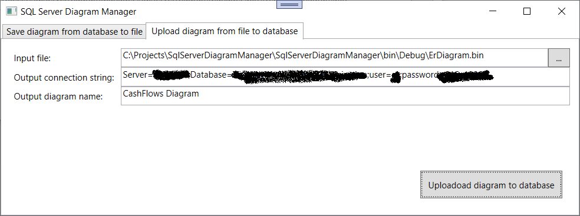

# SqlServerDiagramManager

A very naïve tool to download and upload the binary data of SQL server Entity-Relationship diagrams.

Download the E-R binary data from SQL server to a local file:

Upload the E-R binary data from a local file to SQL server:

## Build and run

This utility is a simple WPF application, built with C# in .Net 6.0

- clone this repository
- open the solution file in Visual Studio
- within Visual Studio, build the application and run it

## Buy Me A Coffee! :coffee:

If you can contribute or you want to, feel free to do it at [__Buy me a coffee! :coffee:__](https://www.buymeacoffee.com/starnutoditopo), I will be really thankfull for anything even if it is a coffee or just a kind comment towards my work.

:blush:

**Be careful and donate just if it is within your possibilities, because there is no refund system. And remember that you don't need to donate, it is just a free choice for you. Thank you!**
